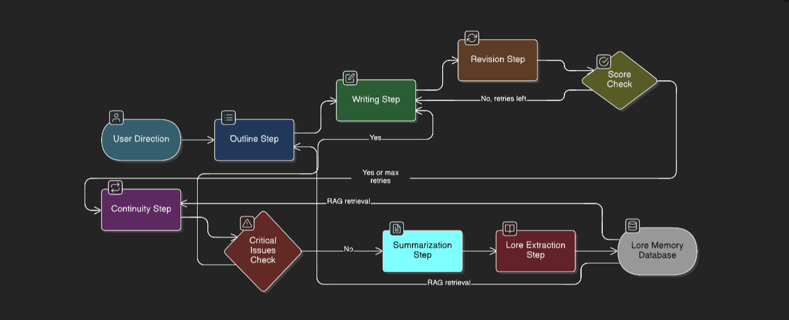

A Multi-Agent Potentially Self Evolving with Lore Aware Memory that focuses on solving Long Term Cohorence Related Issues in Narrative GenAI systems

lore-spring/
├── src/
│   ├── agents/          # All agent node functions
│   │   ├── __init__.py
│   │   ├── writer.py    # writer_agent_node()
│   │   ├── continuity.py
│   │   ├── quality.py
│   │   ├── revision.py
│   │   ├── lore_keeper.py
│   │   └── utils.py     # format_characters(), json_extraction_prompt()
│   ├── graph/           # Workflow definitions
│   │   ├── __init__.py
│   │   ├── state.py     # NarrativeState TypedDict
│   │   ├── main.py      # StateGraph setup, edges, compile()
│   │   └── subgraphs.py # Revision subgraph
│   ├── services/        # External DBs/clients
│   │   ├── __init__.py
│   │   ├── neo4j.py     # retrieve_context_node Cypher
│   │   ├── pinecone.py  # Embeddings upsert/query
│   │   └── postgres.py  # store_chapter(), checkpointer setup
│   └── llm/             # Groq wrappers
│       ├── __init__.py
│       ├── groq_client.py # ChatGroq init, select_model(), retry
│       └── prompts.py   # All system/user prompts
├── api/                 # FastAPI deployment
│   ├── __init__.py
│   ├── main.py          # app = FastAPI(); @app.post("/generate")
│   └── websocket.py     # Streaming endpoint
├── config/              # Env/secrets
│   ├── __init__.py
│   └── settings.py      # pydantic BaseSettings for keys
├── tests/               # Unit tests
│   └── test_graph.py    # pytest for nodes/graph
├── .env                 # GROQ_API_KEY, NEO4J_URI, etc.
├── requirements.txt     # langgraph==0.2.*, etc.
├── Dockerfile          # CPU-only deploy
└── README.md           # Roadmap phases

